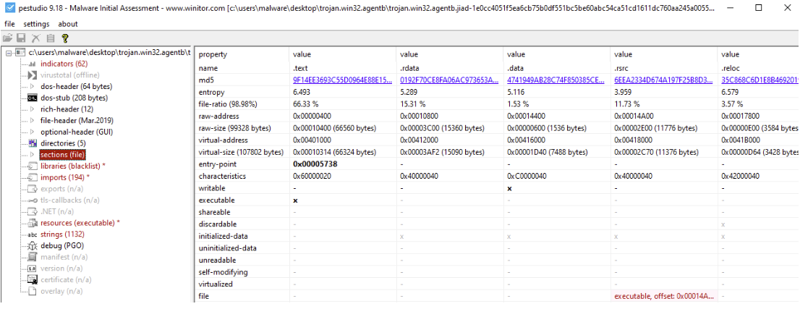
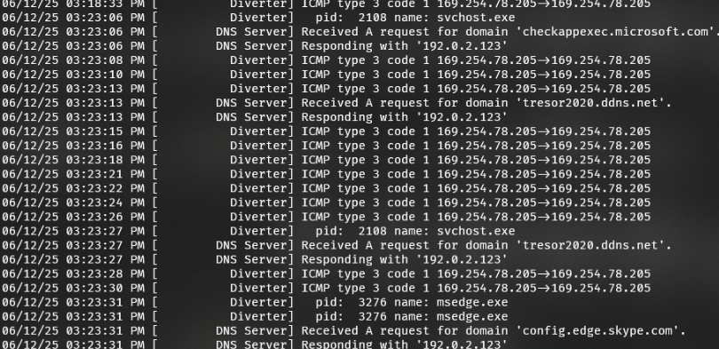
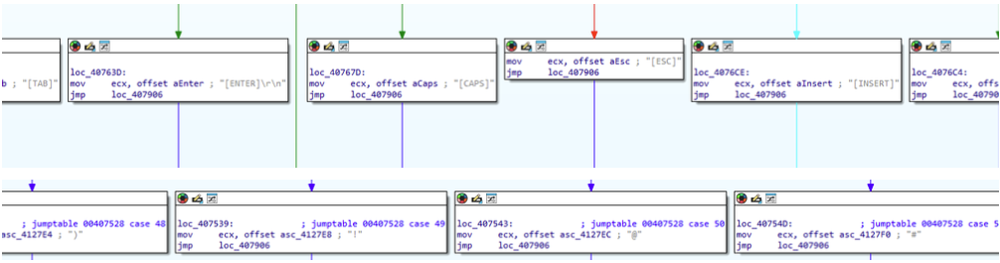

# AveMaria/Warzone Investigation Report

  
  
  

This README is a summary of the full report in [Codice_Malevolo-Report.pdf](Codice_Malevolo-Report.pdf).

## Overview

The analyzed sample is a Windows RAT associated with the AveMaria/Warzone family and is focused on information theft.

Main capabilities reported in the PDF:

- Credential theft from browsers and mail clients.
- Keylogging with active-window context collection.
- Remote desktop configuration abuse for attacker access.
- C2 communication for command retrieval and data exfiltration.

The report also documents a malicious Office document acting as an obfuscated dropper that triggers PowerShell via WMI and launches a second-stage payload (637.exe).

## Analysis Toolchain

1. Static binary triage and packing assessment.
Tools: Exeinfo, PEiD/PEinfo, PEStudio, Strings.
Outcome: no known packer signature was detected, while section analysis still shows high .text entropy and executable-like content, consistent with a suspicious packed/dropper-like profile.

  
  

2. Capability and IOC extraction.
Tools: PEStudio imports/strings, YARA.
Outcome: extracted indicators and behavior cues for registry modification, C2 communication, keylogging, credential theft, anti-analysis, and family markers (AveMaria/Warzone).

3. Dynamic host behavior validation.
Tools: Process Monitor, Process Explorer, Regshot, Autoruns.
Outcome: observed registry and filesystem activity (including AppData staging paths and network-related registry changes), high internal thread activity, and no obvious child-process chain in this run.

4. Network and C2 correlation.
Tools: FakeNet, Wireshark, VirusTotal.
Outcome: repeated DNS callbacks to tresor2020.ddns.net (svchost.exe context) and failed C2 session establishment in the lab (ICMP destination unreachable behavior).

  

5. Reverse engineering of keylogging logic.
Tools: IDA Freeware.
Outcome: identified key translation routines, active window title capture, conditional title logging, and file-write behavior associated with log generation.

  

6. Malicious document execution-chain reconstruction.
Tools: ExifTool, oleid, oletimes, oledump.py, olevba, ViperMonkey, deobfuscated PowerShell analysis.
Outcome: Document_open auto-exec, obfuscated string assembly of hidden PowerShell, WMI process creation via winmgmts:Win32_Process, and second-stage payload download/execution (637.exe).

## Findings

### Family And Objective

- Strong attribution to AveMaria/Warzone (including explicit family strings and C2-domain correlation).
- Primary intent is information theft with remote-control functionality.

### Credential Theft And Collection

- Browser targets include Chromium and Firefox credential stores.
- Mail-related targets include Outlook, Thunderbird, and Foxmail artifacts.
- Windows credential collection is supported through vault-related APIs.

### Keylogging Behavior

- Captures special keys, alphanumeric input, and key names for unhandled keys.
- Tags logs with active window title for contextual exfiltration value.
- Uses conditional title logging to reduce noise and improve operator usability.

### Evasion And Operational Behavior

- Anti-analysis patterns include sleep delays and debugger checks.
- Dynamic API resolution behavior is consistent with static-analysis evasion.
- Command patterns include delayed execution and self-delete style logic.

### Persistence And System Changes

- Persistence-related intent appears in strings and registry-oriented behavior.
- In this run, Regshot and Autoruns did not show clear new startup artifacts, suggesting possible conditional or hidden persistence logic.

### Network Findings

- Repeated DNS traffic to tresor2020.ddns.net from svchost.exe context was observed.
- C2 reachability in the lab was constrained by the controlled environment (destination-unreachable responses).

### Maldoc Findings

- The Word document is an obfuscated dropper.
- Document_open is the execution trigger.
- WMI process creation is used to execute encoded PowerShell stealthily.

## Safety Note

All artifacts should be handled only in isolated analysis environments.

## License

This project is distributed under the MIT License. See [LICENSE](LICENSE).
