# Malware Analysis Report

**Authors:** Edoardo Bazzotti (VR518747), Simone Xiao (VR519027)
**Course:** Codice Malevolo 2024/2025
**Date:** 2025-06-30

<p align="center">
  
  
  
</p>

English translation of the original Italian report ([`report/full-report.pdf`](report/full-report.pdf)). Extracted indicators are in [`IOCS.md`](IOCS.md); the maldoc YARA rule is in [`detections/ave-maria-warzone.yar`](detections/ave-maria-warzone.yar); raw evidence lives under [`evidence/`](evidence/).

## Contents

- [Windows Malware — Analysis](#windows-malware--analysis)
  - [Summary](#summary)
  - [Static Analysis](#static-analysis)
  - [Dynamic Analysis](#dynamic-analysis)
  - [Reverse Engineering (IDA)](#reverse-engineering-ida)
- [Malicious Document — Analysis](#malicious-document--analysis)
  - [Summary](#summary-1)
  - [Static Analysis](#static-analysis-1)
  - [Macro Analysis](#macro-analysis)
  - [Analysis with ViperMonkey](#analysis-with-vipermonkey)
- [License](#license)

---

## Windows Malware — Analysis

### Summary

The analyzed malware is a remote-access Trojan (RAT) of the AveMaria/Warzone family designed for information theft.

Key capabilities include:

- Credential theft from browsers and mail clients.
- Keylogging to record pressed keys.
- Manipulation of Remote Desktop (RDP) settings to guarantee the attacker remote access to the infected machine.
- Communication with a Command & Control (C2) server to exfiltrate stolen data and receive commands via the `svchost.exe` process.

### Static Analysis

#### Is the malware packed? If so, which packer was used? Which elements of the PE file indicate that the malware is packed?

<p align="center">
  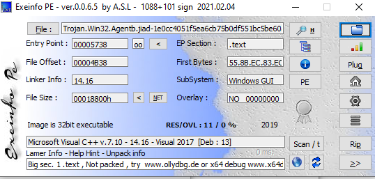
</p>

With Exeinfo, the presence of "Microsoft Visual C++" as the main result indicates that the file is not packed with a generic packer (such as UPX, Themida, etc.), but was compiled directly with Visual C++. Had it been packed, we would have seen the packer's signature (e.g. "UPX") instead of the compiler.

<p align="center">
  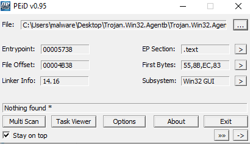
</p>

PEiD likewise detected no known packer signature. `"Nothing found *"` shows that its signature database has no matches for common packers or obfuscators.

In PEstudio the `signature` field is shown as `n/a`, indicating that no known packer signature was detected. In addition, the `compiler-stamp` field shows `0x5C8B50C7` (Wed Mar 13 01:37:27 2019), further confirmation that the file is a compiled executable and was not subsequently processed by a packer that would alter this information.

<p align="center">
  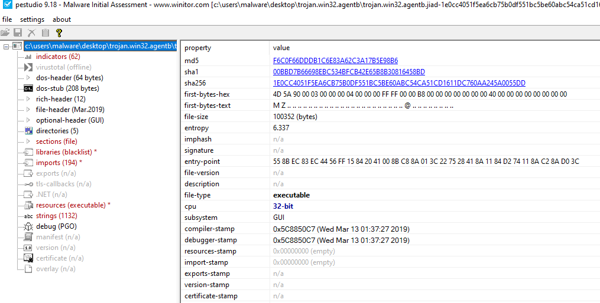
</p>

However, the `sections` window in PEstudio reveals a rather high entropy for the `.text` section — precisely **6.493** — a value approaching that of compressed data. Furthermore, PEstudio flags the presence of an executable file within the section itself (typical of droppers).

<p align="center">
  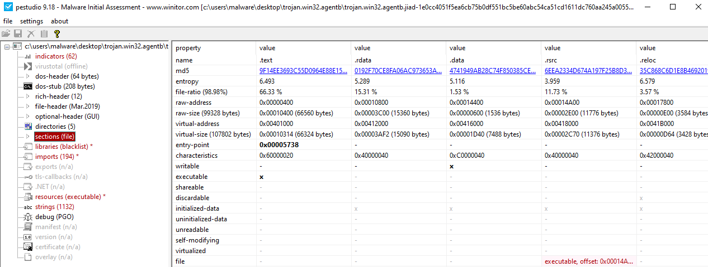
</p>

#### Which APIs are imported by the malware? What possible behavior does the malware exhibit based on the imported APIs?

1. **Persistence and Privilege Escalation:** `RegSetValueExW`, `RegOpenKeyExW`, `RegCreateKeyExW` indicate the ability to modify the registry. This suggests potential persistence attempts (execution at system startup) or privilege escalation.

2. **C2 Server Communication:** `InternetCheckConnectionW`, `InternetOpenW`, `InternetConnectW`, `InternetReadFile`, and `23 (socket)`, `3 (closesocket)`, `10 (ioctlsocket)`, `21 (setsockopt)` are functions for communicating via the Internet. They allow establishing an Internet session, connecting to a server, and reading data from a remote resource. Typical for connecting to Command and Control (C2) servers, from which to receive commands or download payloads.

3. **File Manipulation:** `ReadFile`, `WriteFile`, `CreateFileW`, `DeleteFileW` allow the malware to create, read, write, and delete files on disk. Fundamental for a dropper (to release a payload) and to manage files/configurations.

4. **File and Process Execution:** `CreateProcessW` and `ShellExecuteExW` — ways in which the malware can launch the downloaded payload or other malicious components.

5. **Single Instance:** `CreateMutexW`, `OpenMutexW`, `ReleaseMutex`, `WaitForSingleObject` — to ensure that only one instance of the malware is running and for internal synchronization.

6. **Analysis Evasion:**
   - `Sleep`: anti-analysis technique, used to delay execution and evade automated sandboxes.
   - `IsDebuggerPresent`: detects whether it is running in a debugging environment, in order to alter behavior to evade analysis.
   - `LoadLibraryW` and `GetProcAddress`: allow loading libraries and functions at runtime, in order to evade static analysis and add flexible modules.

7. **Encryption:** `CryptStringToBinaryA`, `CryptUnprotectData` allow the malware to decrypt data.

8. **Keylogging:** `GetKeyState`, `GetRawInputData`, `GetLastInputInfo` suggest the ability to capture keyboard input.

Based on the above, a possible malware behavior could be:

1. Verify the existence of other instances and prevent duplicates.
2. Establish persistence and attempt to obtain elevated permissions on the system.
3. Create a socket for communication with a C2 server to receive commands and download additional files to disk or memory.
4. Use anti-analysis techniques to evade detection: dynamic library loading, debugger detection, sleep, etc.
5. Potentially collect information from the system, perform keylogging, and encrypt data.

#### Which strings are contained in the malware? Are there strings that correspond to files or folders? Windows registry subkeys? URLs? IP addresses?

**1. IP addresses**

- `http://5.206.225.104/dll/softokn3.dll`
- `http://5.206.225.104/dll/msvcp140.dll`
- `http://5.206.225.104/dll/mozglue.dll`
- `http://5.206.225.104/dll/vcruntime140.dll`
- `http://5.206.225.104/dll/freebl3.dll`
- `http://5.206.225.104/dll/nss3.dll`

The IP `5.206.225.104` is almost certainly the Command and Control (C2) server from which the malware downloads payloads or additional libraries not present in the PEstudio import section, confirming that some dependencies are loaded dynamically.

**2. Information Theft**

- **Browser credentials:**
  - The malware targets Firefox (`firefox.exe`, `profiles.ini`, `logins.json`) and Chrome (`\Google\Chrome\User Data\Default\Login Data`).
  - The query `SELECT * FROM logins` is used to extract credentials from the databases.
  - The DLLs downloaded from the C2 (`nss3.dll`, `softokn3.dll`, etc.) are the libraries required to decrypt passwords stored by Firefox. This is classic infostealer behavior.

  <p align="center">
    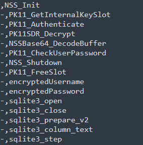
  </p>

- **Email credentials:**
  - The malware looks for credentials from mail clients such as Outlook, Thunderbird (`thunderbird.exe`), and Foxmail (`software\Aerofox\FoxmailPreview`).
  - The strings `POP3 User`, `POP3 Password`, `SMTP Server`, `IMAP Password` indicate the ability to extract and interpret mail account configurations.

- **Windows credentials (Windows Vault):**
  - The presence of the `vaultcli.dll` library and the APIs `VaultOpenVault`, `VaultEnumerateItems`, `VaultGetItem` indicates that the malware is able to steal credentials saved in the Windows Credential Manager.

**3. Persistence and Privilege Escalation**

- The registry key `Software\Microsoft\Windows\CurrentVersion\Run\` and the string `InitWindows` suggest that the malware attempts execution at system startup.
- `Elevation:Administrator!new:{3ad05575-8857-4850-9277-11b85bdb8e09}` — a string that suggests an attempt to execute code with elevated privileges.

**4. Evasion**

- `cmd.exe /C ping 1.2.3.4 -n 2 -w 1000 > Nul & Del /f /q`:
  - Delays execution. The ping to an unreachable address with a timeout introduces a pause.
  - `Del /f /q` indicates that the file attempts to self-delete, probably after executing its payload.
- `OpenProcess`, `WriteProcessMemory`, and `CreateRemoteThread` are used to inject code into other processes, in order to hide malicious activity inside a legitimate process (`svchost.exe`).

**5. Keylogging**

- `GetRawInputData`, `GetAsyncKeyState`, `GetKeyState`: provide keylogging capabilities, allowing the malware to capture keys pressed by the user.
- `[TAB]`, `[CTRL]`, `[ALT]`, `[ENTER]\r\n`, `[BKSP]`: strings for formatting the data captured from the keyboard.

**6. Remote Desktop (RDP) Manipulation**

- The malware interacts with the registry keys related to Terminal Services and Terminal Server.
- The strings `fDenyTSConnections`, `EnableConcurrentSessions`, and `AllowMultipleTSSessions` indicate that the malware modifies RDP settings to enable remote access to the machine and to allow multiple concurrent RDP sessions, permitting the attacker to connect without disconnecting the legitimate user.

**7. Developer trace**

A particularly interesting string:

- `C:\Users\louis\Documents\workspace\MortyCrypter\MsgBox.exe`

This debug path suggests that the malware was processed with a custom packer/crypter called **MortyCrypter** and compiled on a machine with the username **louis**.

**8. AVE MARIA WARZONE malware family**

- `ascii,8, 0x000123E0,-,-,-,AVE_MARI`
- `ascii,10,0x00010E1C,-,-,-,warzone160`

These are direct indicators linking the malware to the well-known **AveMaria/Warzone RAT** family, a commercial Trojan known for its broad functionality.

#### Are some strings obfuscated or encrypted? Which encoding or encryption algorithm is used?

The analysis identified the standard Base64 alphabet string:

```
0123456789ABCDEFGHIJKLMNOPQRSTUVWXYZabcdefghijklmnopqrstuvwxyz
```

Furthermore, the presence of the API `NSSBase64_DecodeBuffer` indicates that the malware uses Base64 encoding, most likely to decode configurations or commands sent by the C2 server and to encode the stolen data before exfiltration.

The malware does not contain large blocks of encrypted strings in its main body, but several encryption functions are present:

- The `CryptUnprotectData` function and the `SOFTWARE\Microsoft\Cryptography` registry key are used to decrypt passwords saved by Google Chrome and other Chromium-based browsers, which use DPAPI to protect credentials with a key tied to the Windows user account.
- **NSS libraries:** dynamically downloaded (e.g. `nss3.dll`, `softokn3.dll`). Functions such as `NSS_Init` and `PK11SDR_Decrypt` confirm that the malware uses Mozilla's decryption tools to access passwords.

### Dynamic Analysis

#### Does the malware create or modify keys or subkeys in the Windows registry? If so, which ones?

Using Regshot to compare the state of the registry before and after infection, the following relevant modifications were identified:

**1. Network Settings Modification**

Two values were added to the subkey `HKCU\SOFTWARE\Microsoft\Windows\CurrentVersion\Internet Settings`:

- `MaxConnectionsPer1_0Server: 0x0000000A (10)`
- `MaxConnectionsPerServer: 0x0A (10)`

This modification increases the maximum number of simultaneous connections that a process can establish toward a C2 server, in order to optimize and accelerate communications for payload downloads or data exfiltration.

**2. Group Policy Manipulation**

The malware deleted the following keys:

- `HKLM\SOFTWARE\Microsoft\Windows\CurrentVersion\Group Policy\ServiceInstances\730fc3c4-2466-4af1-9ba5-c212d98971cd`
- `HKLM\SOFTWARE\WOW6432Node\Microsoft\Windows\CurrentVersion\Group Policy\ServiceInstances\730fc3c4-2466-4af1-9ba5-c212d98971cd`

And added the following:

- `HKLM\SOFTWARE\Microsoft\Windows\CurrentVersion\Group Policy\ServiceInstances`
- `HKLM\SOFTWARE\WOW6432Node\Microsoft\Windows\CurrentVersion\Group Policy\ServiceInstances`

The malware first deletes and then recreates keys tied to Group Policy. This could be a technique to disable security policies, weaken system defenses, or register its own malicious component as a service.

#### Does the malware create or delete folders or files on the virtual machine? If so, which ones?

**1. Creation of operational directories**

Analysis with Process Monitor, filtered on `Operation is CreateFile`, surfaced two main directories used to store its components and collected data:

- `C:\Users\[Username]\AppData\Local\VirtualStore\Program Files\Microsoft DN1`

  The `AppData\Local` folder is a common location for malware since it does not require administrative privileges to write to. The name `Microsoft DN1` was chosen to avoid raising suspicion.

- `C:\Users\[Username]\AppData\Local\Microsoft Vision`

  Here too, the name `Microsoft Vision` seems legitimate.

<p align="center">
  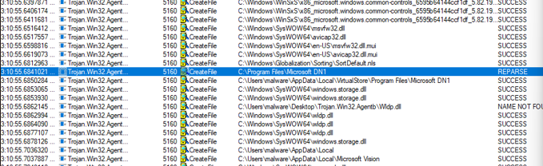
</p>

#### Does the malware create any other processes?

No, the malware `Trojan.Win32.Agentb.exe` does not create new child processes.

Analysis with Process Monitor, filtered on `Operation is Process Create`, showed no events with the malware process (PID 512) as parent. As visible in Process Explorer, `Trojan.Win32.Agentb.exe` remains an isolated process under `explorer.exe`, without launching other executables.

<p align="center">
  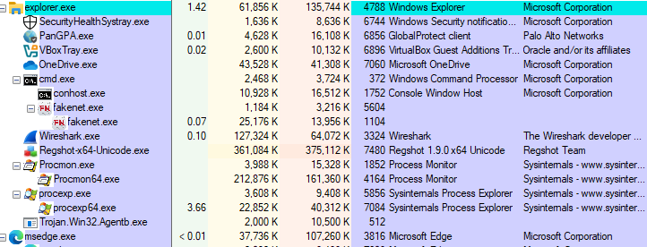
</p>

This behavior suggests that the malware uses a more sophisticated execution technique.

However, although it does not create child processes, the malware is very active internally. As shown by the Process Monitor image, the malicious process constantly generates new threads.

<p align="center">
  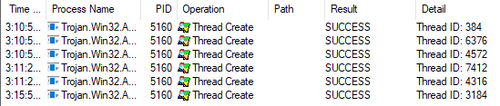
</p>

#### Is the malware persistent on the virtual machine? If so, what technique does it use to achieve persistence?

Neither the registry comparison with **Regshot** nor the scan with **Autoruns** revealed the creation of new autostart keys, services, or scheduled tasks attributable to the malware.

<p align="center">
  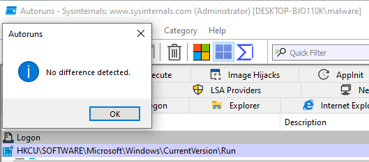
</p>

It is plausible that the persistence technique is likewise well hidden or activated conditionally to evade detection.

#### Does the malware initiate network connections? If so, what kind of traffic does it generate? Which URLs or IP addresses does it try to contact?

Network-traffic analysis, conducted with FakeNet and Wireshark, revealed that the malware actively establishes network connections to communicate with a Command and Control (C2) server.

<p align="center">
  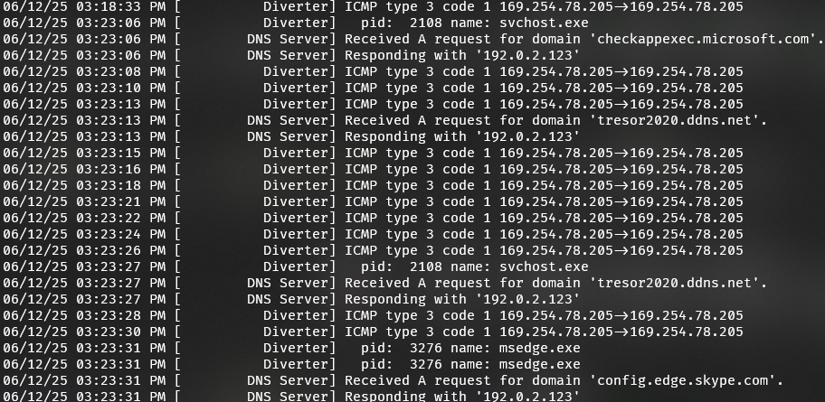
</p>

From the FakeNet window we see that the malware repeatedly contacts the following domain via DNS requests:

- `tresor2020.ddns.net`

All malicious network requests were **not** generated by the original process (`Trojan.Win32.Agentb.exe`), but by an instance of a legitimate system process:

- `svchost.exe` (PID 2108)

The DNS requests to the C2 are sent at regular intervals. After resolving the IP address of the C2, the malware immediately attempts to establish a TCP/UDP session, but receives ICMP "Destination unreachable (Port unreachable)" packets, captured by Wireshark.

<p align="center">
  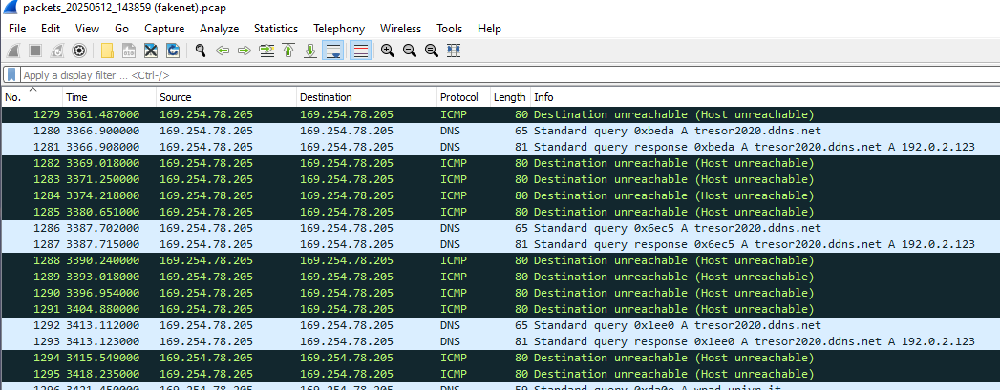
</p>

A check of the identified C2 domain, `tresor2020.ddns.net`, on VirusTotal confirms that this domain is widely documented as a Command and Control server for the **Warzone RAT (Ave Maria)** malware family. This confirms that the `warzone` and `AVE_MARI` strings found during static analysis were not random, but precisely identified the malware family.

### Reverse Engineering (IDA)

#### Analysis of function `sub_407966`

**Who calls `sub_407966`?**

To understand the context in which the logging function `sub_407966` operates, its cross-references (Xrefs) were analyzed via IDA (X key). It was discovered that it is called inside the function `sub_4074D5`. Inside it we notice a large block structure that handles keyboard keys. This suggests we are looking at a **keylogger**.

**Key translation**

- **Special keys:** the routine explicitly handles keys such as `[ENTER]`, `[TAB]`, `[BKSP]` (Backspace), `[CTRL]`, `[ALT]`, `[CAPS]`, `[ESC]`, `[INSERT]`, `[DEL]`, loading the corresponding string into `ecx`.
- **Numeric keys and symbols:** checks the state of the SHIFT key using `GetAsyncKeyState(VK_SHIFT)`.
  - If SHIFT is pressed (e.g. `SHIFT+2` to obtain `@`), the jump table (`jpt_407528`) points to an instruction that loads the address of the string `"@"` into `ECX`.
  - If SHIFT is not pressed, it handles numeric keys as simple digits.
- **Alphanumeric characters:** handles the letters (A to Z) and other printable characters, accounting for the state of the SHIFT and CAPS LOCK keys to determine whether the character is uppercase or lowercase.
- **Unhandled keys:** if a key does not fall into the previous categories (e.g. function keys F1–F12), it uses the `GetKeyNameTextW` API to obtain a textual representation of the key.

<p align="center">
  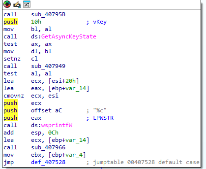
</p>

Regardless of the path chosen, at the end `jmp loc_407906` is executed with the register `ECX` always containing the pointer to the string of the key to be recorded.

Once the corresponding string is formatted, execution flow converges at the end of the function, where `call sub_407966` is executed — the initial subroutine, which:

1. Obtains the title of the currently active window.
2. Compares the current title with the last title it recorded.
3. Only if the window title has changed (for example, the user switched browser tabs, opened a new program, etc.) is the new title written to the log file, typically formatted as `\r\n{New Window Title}\r\n`.
4. Finally, the pressed character is written immediately after the new title.

**1. Active window title acquisition**

As soon as `sub_407966` is executed, the first thing it does is save the parameter received. Later, when it is time to write the key to the log file, the function retrieves the pointer `[ebp+lpString]` and uses it as the buffer for the call to `WriteFile`.

It then calls `GetForegroundWindow` and `GetWindowTextW` to obtain the title of the window in which the user is typing. This is fundamental for giving context to the recorded keys (e.g. to understand whether the user is typing in a browser, a mail client, a text editor, etc.).

<p align="center">
  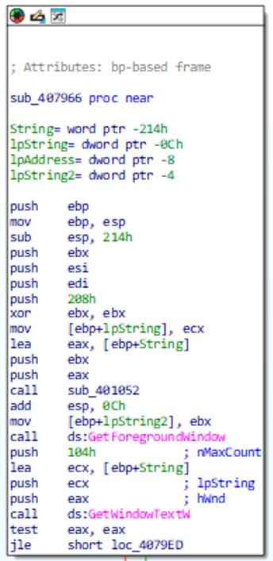
</p>

**2. String formatting**

The window title is formatted between curly braces, e.g. `{Window Title}`. If it cannot obtain a title, it uses `{Unknown}`.

If the window title is obtained successfully, a series of subroutines (`sub_4033AB`, `sub_403230`, `sub_4030FB`) formats it.

The instructions `push offset asc_4127C8 ; "{"` and `push offset asc_4127CC ; "}"` enclose the title between curly braces, transforming for example `"Documento1 - Blocco note"` into `{Documento1 - Blocco note}`.

<p align="center">
  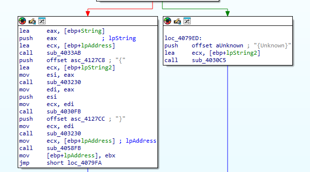
</p>

**3. Conditional title-writing logic**

The malware does not write the window title for every single key press, but only when the active window changes.

```
.text:00407A1F  call sub_4033AB   ; Copies the previous title into a temporary buffer
.text:00407A25  lea  ecx, [ebp+lpString2] ; Contains the current formatted title
.text:00407A28  call sub_40300E   ; Compares the current title with the previous one
.text:00407A41  jz   short loc_407A4F ; If titles are identical, skip the title write
```

<p align="center">
  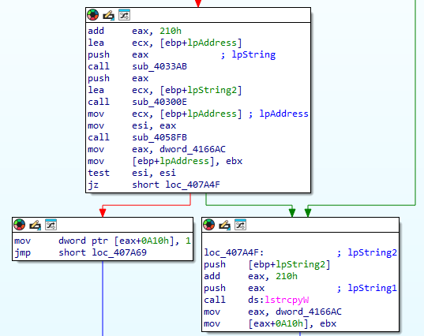
</p>

**4. File writing**

1. Retrieves the pointer to the key string saved at the start in `[ebp+lpString]`.
2. Calls `lstrlenW` to compute the string length (e.g. for `"[SHIFT]"` this will be 7).
3. Multiplies the length by 2 (`add eax, eax`) because the characters are Unicode (2 bytes each).
4. Calls `WriteFile` to write the string to the open log file.

A call to `ds:CreateFileW` opens a handle to a file. The `dwCreationDisposition` parameter set to `4` (`OPEN_ALWAYS`) creates the file if it does not exist, otherwise it is opened for appending data. Subsequently, a series of calls to `ds:WriteFile` (address loaded into `ebx`). Finally, `ds:CloseHandle` closes the file to save the changes.

<p align="center">
  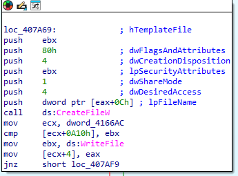
</p>

<p align="center">
  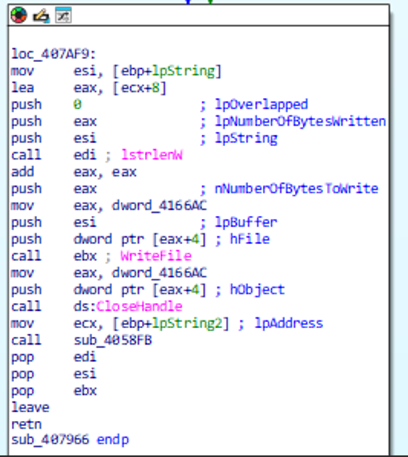
</p>

The filename used by `CreateFileW` is located at address `[dword_4166AC + 0x0C]`. `dword_4166AC` is a global variable — a pointer to a larger data structure used by different parts of the malware.

We therefore tried to discover the content of `dword_4166AC` by analyzing the *write*-type Xrefs of `dword_4166AC`. `offset dword_416D98` loads the address of `dword_416D98` into `esi`, then writes it into `dword_4166AC`. So `dword_4166AC` is a pointer to `dword_416D98`.

However, analyzing the Xrefs of `dword_416D98`, we notice that it is just a flag, and not the path in which the log file is created.

Starting again from the Xrefs of `dword_4166AC`, we arrive at `sub_407376` — this time hitting the mark.

The function calls `SHGetFolderPathW`. The parameter `csidl = 0x1C` (28) is a system constant that corresponds to the current user's AppData folder (`C:\Users\Username\AppData\Roaming`). The result is written directly into the global buffer pointed to by `eax`.

Subsequently, the code calls `lstrcatW` (string concatenation) to append the string `\Microsoft Vision\` — the folder detected during dynamic analysis with Process Monitor.

<p align="center">
  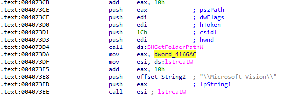
</p>

The malware then retrieves the time and date and uses them to create a unique filename — for example `13-06-2025_01.37.27`. This string is appended to the path. The buffer now contains the complete path of the log file:

```
C:\Users\...\Microsoft Vision\13-06-2025_01.37.27
```

<p align="center">
  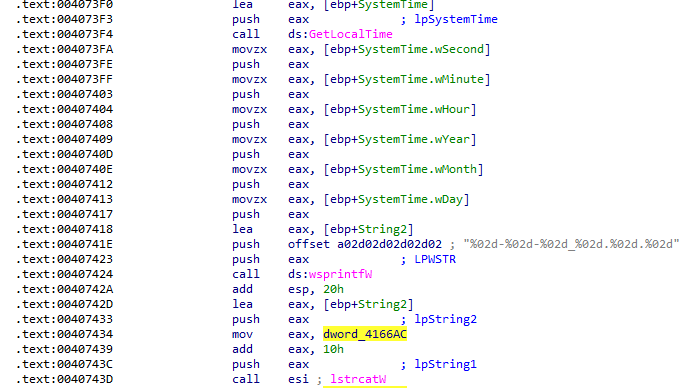
</p>

---

## Malicious Document — Analysis

### Summary

The Word document is an obfuscated dropper. On opening, the `Document_open` function runs automatically and assembles a malicious PowerShell command from hidden string fragments. To execute it stealthily, the macro does not launch PowerShell directly but abuses **WMI (Windows Management Instrumentation)** to create a new process. The final goal of this command is to execute the payload that constitutes the next stage of the attack, completing the infection of the system.

### Static Analysis

#### 1. Metadata analysis with exiftool

Through analysis with `exiftool` we discover several pieces of information:

- **Author:** `Mathilde Bernard` — probably fake.
- **Software:** `Microsoft Office Word` — indicates it was created with Word.
- **Create Date / Modify Date:** `2019:12:19 13:19:00` — the dates are identical, which suggests that the document was created and saved in a single session, without subsequent modifications. Typical of automatically generated maldocs.
- **Comp Obj User Type:** `Microsoft Forms 2.0 Form`. Through further research, the presence of Microsoft Forms suggests the use of ActiveX controls (forms) to embed and activate the malicious VBA macro in a way that evades security checks.

#### 2. Strings analysis with `strings`

Searching for the keyword `open`, `Document_open` stands out — according to Microsoft Word VBA documentation, this is a feature to execute code when the document is opened (similar to `AutoOpen`).

<p align="center">
  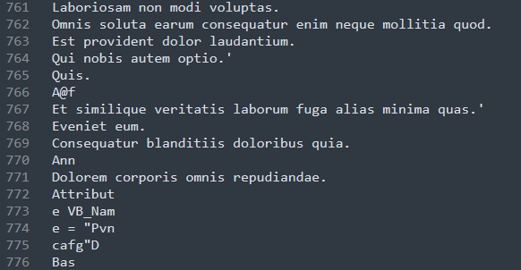
</p>

The text in Latin represents noise inserted to deceive antiviruses. Further down we find the `VB_Name` attribute set to `"Pvncafg"` (and later to `"Llzjsomymu"` and `"Qnrnsagenrr"`). These could be obfuscated names of VBA modules.

<p align="center">
  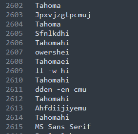
</p>

In this section we observe a repetition of the string `"Tahoma"` alternating with other suspicious strings: `"owershei"`, `"ll -w hi"`, `"dden -en cmu"`. Concatenating them yields:

```
owersheill -w hidden -en cmu
```

This appears to be a PowerShell command with parameters that hide the window (`-w hidden`). `-en` is an abbreviation for `-EncodedCommand` — it allows executing a PowerShell command that has been Base64-encoded.

#### 3. Pattern analysis with YARA

We created a custom YARA rule based on the indicators that emerged during the previous phases, in order to obtain reliable positive matches.

<p align="center">
  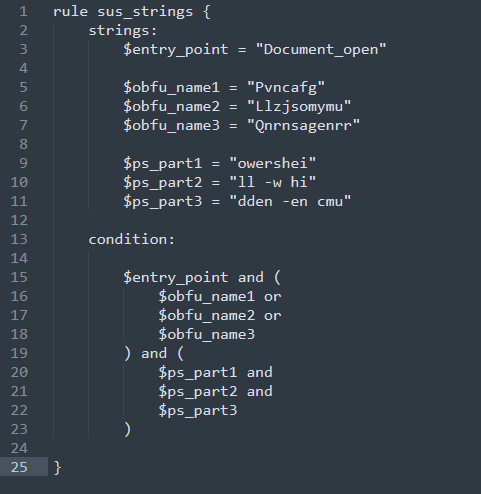
</p>

The document analysis continued with the Oletools framework, starting with `oleid` to obtain a quick risk assessment.

<p align="center">
  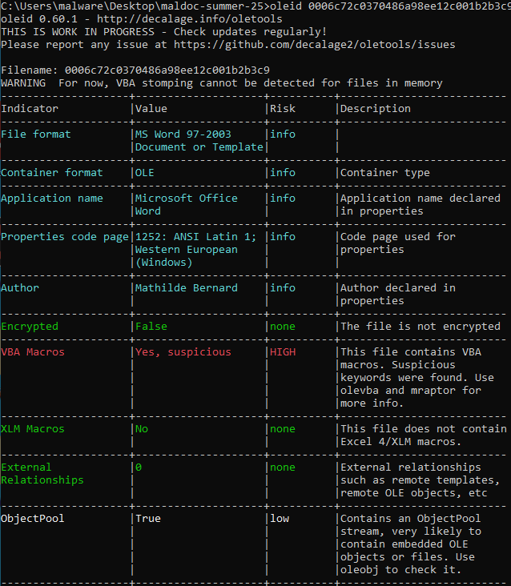
</p>

`oleid` confirms that this is an MS Word 97-2003 file. The most important indicator is `VBA Macros`, which returned the value `"Yes, suspicious"` with a HIGH risk level. This indicates that `oleid` has already detected suspicious keywords inside.

Analysis of the temporal metadata was deepened with `oletimes`, where we observe that all streams critical to the malware's execution (`Macros` containing the VBA modules, and the VBA modules with obfuscated names such as `Macros/Llzjsomymu`) were created and modified within 0/1 seconds. This suggests that the document was generated by a script.

To inspect the structure and locate the VBA code, `oledump.py` was used.

<p align="center">
  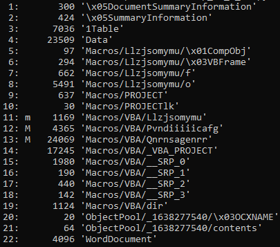
</p>

Three streams containing VBA code were identified, recognizable by the `M/m` indicator:

- `11 (m): Macros/VBA/Llzjsomymu`
- `12 (M): Macros/VBA/Pvndiiicafg`
- `13 (M): Macros/VBA/Qnrnsagenrr`

Stream 11 is marked with a lowercase `m`. This signals the presence of an automatic-execution entry point — in our case, `Document_Open`.

Furthermore, the stream names (`Llzjsomymu`, `Pvndiiicafg`, `Qnrnsagenrr`) correspond exactly to the obfuscated module names (`VB_Name`) identified during static analysis with `strings`.

### Macro Analysis

Analysis of the VBA code was conducted with `olevba --reveal --deobf`, thanks to which we are able to recover the deobfuscated code.

<p align="center">
  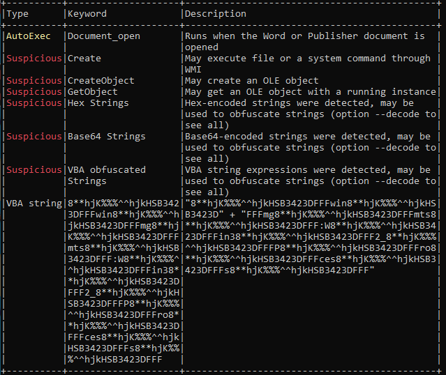
</p>

From the summary table provided by `olevba`, we immediately obtain important information about the malware's behavior:

- **AutoExec:** `Document_open` confirmed.
- **Suspicious:** the keywords `Create`, `CreateObject`, `GetObject` are all tied to the use of WMI for command execution.
- **Suspicious:** VBA obfuscated strings — string obfuscation techniques are in use.

Execution starts from the `Document_open()` function, which is full of "noise code" such as declarations of variables with random names and assignments of never-used Latin strings.

<p align="center">
  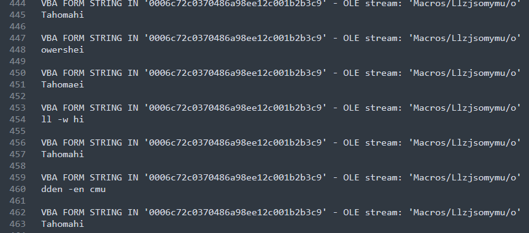
</p>

In this section, `olevba` opened the `Macros/Llzjsomymu/o` stream, finding inside the strings `"owershei"` and `"ll -w hi"` — the same suspicious fragments identified during the string-analysis phase.

#### How is the command executed?

<p align="center">
  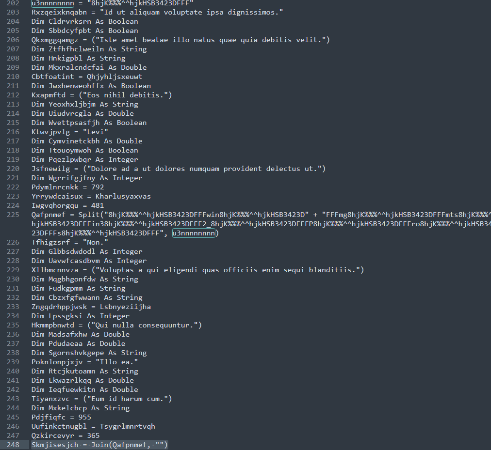
</p>

Scrolling through the code, attention is caught by the only particularly long line. From analysis, the behavior appears to be as follows:

1. Take the long string to be split.
2. Take the delimiter `8**hjK%%%^^hjkHSB3423DFFF` (stored in `u3nnnnnnnn`) and run `Split` → `["win", "mg", "mts", ":W", "in3", "2_P", "ro", "ces", "s"]`.
3. Run `Join` on these pieces to unite them into a single string.

**Result:** `winmgmts:Win32_Process`

A quick search reveals that `winmgmts` is the abbreviation used to access WMI (Windows Management Instrumentation), while `Win32_Process` is the WMI class for managing processes. The created string is then used to obtain an access point to the WMI service.

Subsequently, the `.Create` method is called on the same WMI object. Thus, the malicious document's stealthy strategy for executing a command consists of creating a new process via WMI.

<p align="center">
  
</p>

### Analysis with ViperMonkey

ViperMonkey's analysis highlighted a long Base64-formatted string (`Found possible intermediate IOC (base64): ...`), which could be the encoded PowerShell command launched by the command found previously.

The PowerShell script attempts to download an executable file (`.exe`) from a list of 5 different URLs. It saves the file as `637.exe` in the user's profile folder (`C:\Users\<username>\`). If the download is successful, it executes the file `637.exe`.

The file `637.exe` is the second-stage payload and could be any type of malware: a trojan, ransomware, spyware, keylogger, etc.

The fully deobfuscated PowerShell script is available at [`evidence/maldoc/deobfuscated.ps1`](evidence/maldoc/deobfuscated.ps1). The five failover URLs and the 23,512-byte size gate are listed in [`IOCS.md`](IOCS.md).

---

## License

Distributed under the MIT License. See [LICENSE](LICENSE).
